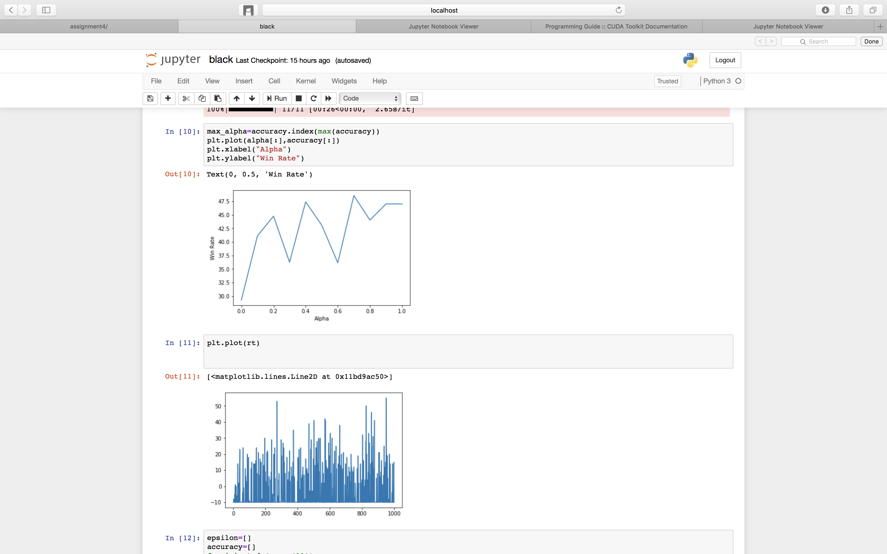
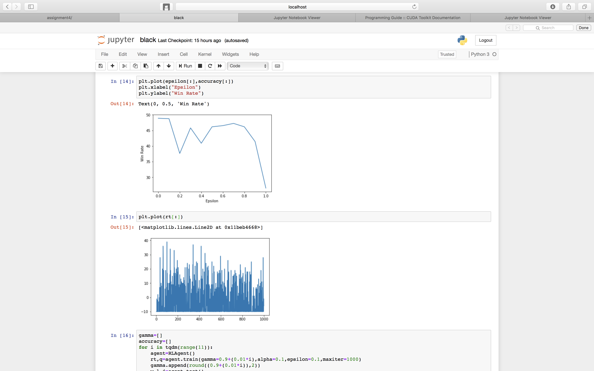
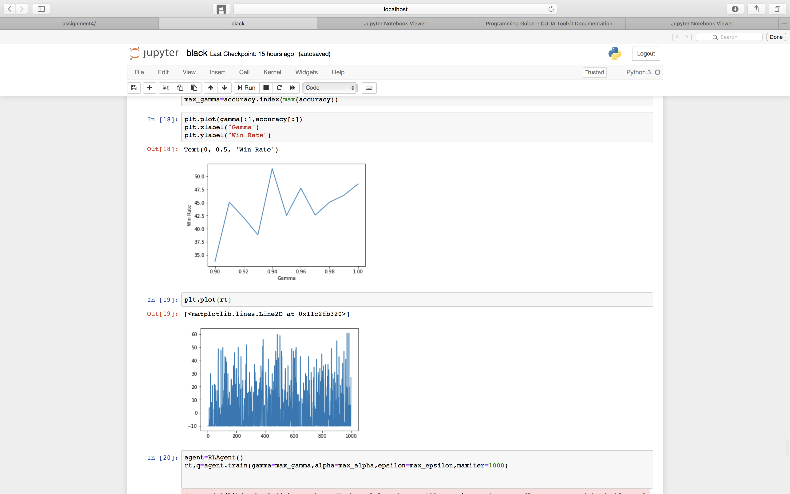
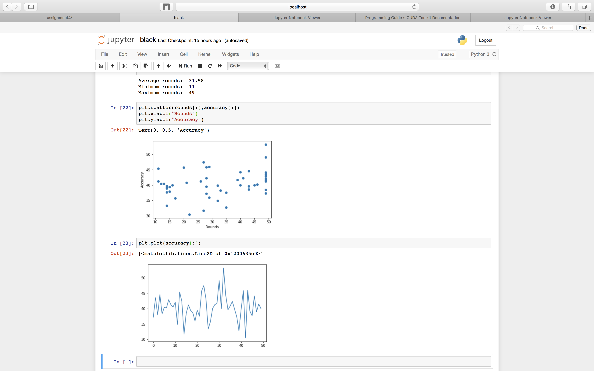

# Reinforcement Learning — Blackjack 🃏

A **Q-learning** agent that learns to play (and bet at) Blackjack from scratch, trained
against a fixed-policy dealer in a custom OpenAI Gym environment. The agent learns two
things at once:

1. **How to play** the hand — *hit* or *stick* — with a tabular Q-learning policy.
2. **How much to bet** each round — *high* or *low* — with a second "Gambler" agent
   that learns from the same reward signal.

> Built as a Reinforcement Learning course assignment. The full derivation, experiments
> and write-up live in [`blackjack.ipynb`](blackjack.ipynb).

---

## Why Q-learning?

Both SARSA and Q-learning are Temporal-Difference (TD) control methods; they differ in how
the Q-table is updated:

| | Update target | Policy |
|---|---|---|
| **SARSA** | `Q(s,a) ← Q(s,a) + α·(r + γ·Q(s′,a′) − Q(s,a))` | on-policy (uses the action actually taken) |
| **Q-learning** | `Q(s,a) ← Q(s,a) + α·(r + γ·maxₐ Q(s′,a) − Q(s,a))` | off-policy (uses the best next action) |

Blackjack has **no irreversible "bad" actions** — there's no risk in exploring — so the
off-policy, exploration-greedy nature of **Q-learning** is the better fit. We want the
agent to explore every state freely and converge directly on the optimal greedy policy.

---

## The environment

A custom `BlackjackEnv` (subclassing `gym.Env`) models a single player vs. a fixed dealer
with an **infinite deck**, plus a **betting/bankroll layer** on top of standard Blackjack:

- **Actions:** `hit` (1) or `stick` (0).
- **Dealer policy:** draws until its hand totals ≥ 17.
- **Rewards:** `+1` win, `0` draw, `-1` loss; `+1.5` for a natural blackjack.
- **Bankroll:** each player starts with a balance of **10** and bets **1–10** per round;
  winnings double the bet, draws return it, losses forfeit it.
- **State (observation):** `(player_sum, dealer_upcard, usable_ace)`.

### Two cooperating agents

| Agent | Decides | Q-table shape | Meaning |
|-------|---------|---------------|---------|
| `RLAgent` | hit / stick | `(32, 11, 2, 2)` | player sum × dealer upcard × usable ace × action |
| `GamblerAgent` | bet high / low | `(32, 11, 2)` | player sum × dealer upcard × bet action |

Both are trained with the same Q-learning update. The Gambler learns to **bet high in
states that paid off before** and **bet low in states that previously lost**, which
measurably beats betting random amounts.

---

## Results & graphs

The model was tuned by sweeping one hyperparameter at a time (the other two held fixed)
and measuring win rate. Each plot below pairs the **win-rate curve** with the
**reward-sum trace** over 1,000 training iterations.

### Win rate vs. learning rate (α)
Best around **α = 0.7** (strong values: 0.1, 0.4, 0.7).



### Win rate vs. exploration rate (ε)
Best around **ε = 0.1** (also good at 0.3) — a little exploration goes a long way.



### Win rate vs. discount factor (γ)
Best around **γ = 0.94** (also good at 0.96, 0.99).



### Final agent — accuracy vs. rounds survived
With the best parameters (**α = 0.7, ε = 0.1, γ = 0.94**), the agent wins **~40% of
hands** and survives **~31 rounds on average** (min 11, max 49) before running out of
bankroll — clearly better than the random-betting baseline.



---

## Project layout

```
ReinforcementLearning-Blackjack/
├── blackjack.ipynb     # full implementation, experiments & write-up
├── alpha.png           # win rate vs learning rate (α) + reward trace
├── epsilon.png         # win rate vs exploration rate (ε) + reward trace
├── gamma.png           # win rate vs discount factor (γ) + reward trace
├── testplot.png        # final accuracy vs rounds (best parameters)
└── LICENSE
```

## Run it yourself

```bash
git clone https://github.com/himanshudhawale/ReinforcementLearning-Blackjack
cd ReinforcementLearning-Blackjack

pip install numpy matplotlib seaborn tqdm "gym<0.26"

jupyter notebook blackjack.ipynb
```

Then run the cells top-to-bottom to rebuild the environment, train the agent, sweep the
hyperparameters, and regenerate the plots above.

## Key takeaways

- Q-learning converges to a sensible Blackjack policy purely from reward feedback.
- A small amount of exploration (ε ≈ 0.1) outperforms both greedy and highly random play.
- Layering a **learned betting policy** on top of the play policy lifts long-run returns
  versus betting random amounts.
- A single game is noisy — the agent should be judged over multiple games, where the
  ~40% win rate and bankroll survival are consistent.

## License

[MIT](LICENSE)
